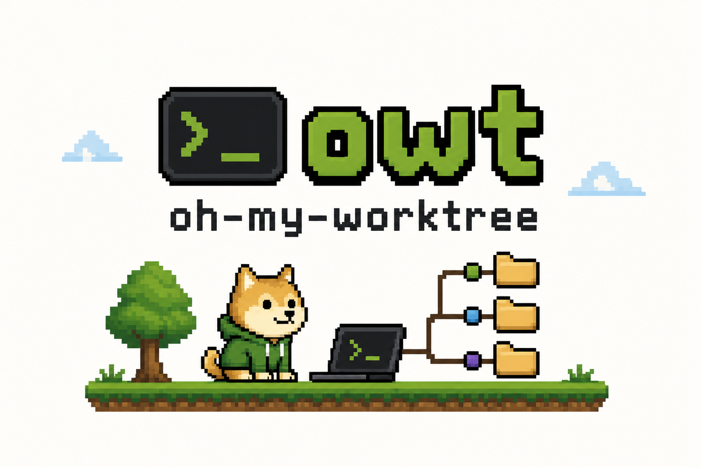

# owt (oh-my-worktree)

[한국어](./README.ko.md) | [English](./README.md)

일반 Git repository와 bare `.bare` layout 모두에서 Git worktree를 관리할 수 있는 TUI 도구입니다.



## Git Worktree란?

Git worktree를 사용하면 하나의 저장소에서 여러 브랜치를 동시에 체크아웃할 수 있습니다. stash나 branch 전환 없이 여러 작업을 병렬로 진행할 수 있습니다.

일반 repository layout:

```
repo/                       # 기존 non-bare repository
└── .git/

~/.owt/worktree/repo/
├── feature-auth/           # owt가 생성한 새 worktree
└── hotfix-payment/         # 또 다른 worktree
```

Bare `.bare` layout:

```
project/
├── .bare/                # bare repository (숨김)
├── main/                 # main 브랜치 worktree
├── feature-auth/         # feature 브랜치 worktree
└── hotfix-payment/       # hotfix 브랜치 worktree
```

**owt**는 이 워크플로우를 간단한 TUI로 관리할 수 있게 해줍니다.

기존 일반 Git repository 안에서 `owt`를 바로 실행하거나, `owt clone`으로 project-local `.bare` sibling layout을 만들 수 있습니다. 일반 repository에서 새 worktree를 만들면 기본적으로 `~/.owt/worktree/<repo-name>/` 아래에 생성되며, `worktree_root` 설정으로 변경할 수 있습니다.

## 명령어

| 명령어 | 설명 |
|--------|------|
| `owt` | TUI 실행 (기본) |
| `owt clone <URL> [PATH]` | `.bare` layout으로 clone + 첫 worktree 생성 |
| `owt init` | 기존 repo를 `.bare` layout으로 변환하는 가이드 표시 |
| `owt setup` | 쉘 통합 설치 |

## 설치

### npm (권장)

```bash
npm install -g oh-my-worktree
```

npx로 설치 없이 바로 실행:

```bash
npx oh-my-worktree
```

### Cargo

```bash
cargo install --git https://github.com/dding-g/oh-my-worktree
```

소스에서 빌드:

```bash
git clone https://github.com/dding-g/oh-my-worktree.git
cd oh-my-worktree
cargo build --release
# 바이너리: ./target/release/owt
```

## 시작하기

### 기존 일반 Repository

이미 작업 중인 repository에서 바로 시작할 수 있습니다. 변환은 필요하지 않습니다.

```bash
cd /path/to/regular-git-repo
owt
```

일반 repository에서 새 worktree를 만들면 기본적으로 `~/.owt/worktree/<repo-name>/` 아래에 생성됩니다. 다른 위치를 쓰고 싶다면 `worktree_root`를 설정하세요.

### `.bare`로 새 프로젝트 시작

```bash
# .bare sibling layout으로 clone + 첫 번째 worktree 자동 생성
owt clone https://github.com/user/repo.git

# TUI 실행
cd repo/main
owt
```

### 선택 사항: 기존 프로젝트를 `.bare`로 변환

`.bare` sibling 구조를 선호한다면 다음 명령을 실행하세요:

```bash
owt init
```

기존 일반 저장소를 bare + worktree 구조로 변환하는 가이드를 보여줍니다.

수동 변환:

```bash
mv .git .bare
echo "gitdir: ./.bare" > .git
git config --bool core.bare true
git worktree add main main
owt
```

## 사용법

```bash
# worktree 내에서 실행
owt

# 경로 지정
owt /path/to/project
```

### 키 바인딩

| 키 | 동작 |
|---|------|
| `j` / `↓` | 아래로 이동 |
| `k` / `↑` | 위로 이동 |
| `Enter` | 선택한 worktree로 이동 |
| `a` | 새 worktree 추가 |
| `d` | worktree 삭제 |
| `o` | 에디터에서 열기 |
| `t` | 터미널에서 열기 |
| `f` | 모든 remote fetch |
| `p` | remote에서 pull |
| `P` | remote로 push |
| `m` | upstream merge |
| `M` | 브랜치 merge (선택) |
| `r` | 목록 새로고침 |
| `q` | 종료 |

### 상태 아이콘

| 아이콘 | 의미 |
|-------|------|
| `✓` | Clean |
| `+` | Staged 변경사항 |
| `~` | Unstaged 변경사항 |
| `!` | 충돌 |
| `*` | Staged + Unstaged |

Worktree 목록에는 GitHub pull request 상태를 보여주는 `PR` column도 있습니다. `open`, `closed`, `merged`, `draft`만 표시하며, GitHub PR이 없거나 non-GitHub remote, 조회 실패, 알 수 없는 상태는 `-`로 표시합니다.

## 설정

설정 파일: `~/.config/owt/config.toml`

```toml
editor = "code"
terminal = "Ghostty"
worktree_root = "~/.owt/worktree"
copy_files = [".env", ".envrc"]

# 기본값은 비활성화입니다. 활성화하면 worktree 생성 후 .owt/post-add.sh를
# detached tmux 세션에서 실행하고, 스크립트 완료 시 세션이 종료됩니다.
# 직접 shell 실행 fallback은 없습니다.
run_post_add_script_in_tmux = false
```

### 환경 변수

| 변수 | 설명 | 기본값 |
|-----|------|-------|
| `EDITOR` | worktree를 열 에디터 | `vim` |
| `TERMINAL` | 터미널 앱 (macOS) | `Terminal` |

```bash
export EDITOR=code
export TERMINAL=Ghostty
```

## 요구사항

- Git 2.5+ (worktree 지원)
- 일반 Git repository 또는 bare repository layout

## 라이선스

MIT
