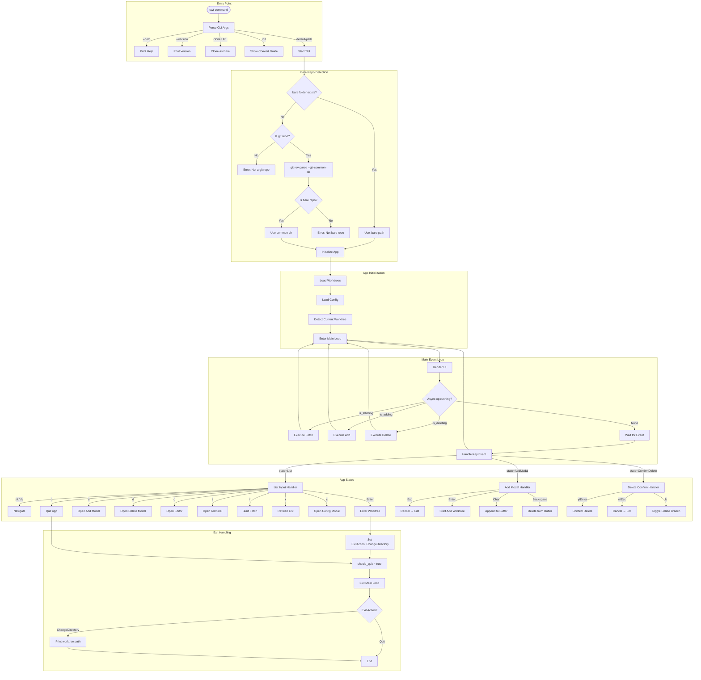

# owt (oh-my-worktree)

A TUI tool for managing Git worktrees in bare repositories.

## Why?

Git worktrees allow you to work on multiple branches simultaneously without stashing or switching. Combined with bare repositories, this creates a powerful workflow:

```
project.git/              # bare repository (metadata only)
├── main/                 # main branch worktree
├── feature-auth/         # feature branch worktree
└── hotfix-payment/       # hotfix branch worktree
```

**owt** makes this workflow effortless with a simple TUI dashboard.

## Features

- **Dashboard view** - See all worktrees with their status at a glance
- **Quick actions** - Create, delete, open worktrees with single keystrokes
- **Smart detection** - Run `owt` from any worktree, it finds the bare repo automatically
- **Clone as bare** - `owt clone <url>` sets up bare repo + first worktree in one command
- **Editor/Terminal integration** - Open worktrees in your preferred editor or terminal

## Installation

### Using npm (Recommended)

```bash
npm install -g oh-my-worktree
```

Or use with npx (no installation required):

```bash
npx oh-my-worktree
```

### Using Cargo (requires Rust)

```bash
cargo install --git https://github.com/dding-g/oh-my-worktree
```

Or build from source:

```bash
git clone https://github.com/mattew8/oh-my-worktree.git
cd oh-my-worktree
cargo build --release
# Binary at ./target/release/owt
```

### PATH setup

For cargo installation, ensure `~/.cargo/bin` is in your PATH:

```bash
# Add to ~/.zshrc or ~/.bashrc
export PATH="$HOME/.cargo/bin:$PATH"
```

## Usage

### TUI Mode (default)

```bash
# Run from bare repo or any worktree
owt

# Or specify path
owt /path/to/repo.git
```

### Keybindings

| Key | Action |
|-----|--------|
| `j` / `↓` | Move down |
| `k` / `↑` | Move up |
| `a` | Add new worktree |
| `d` | Delete worktree |
| `o` | Open in editor |
| `t` | Open in terminal |
| `f` | Fetch all remotes |
| `r` | Refresh list |
| `q` | Quit |

### Subcommands

#### Clone as bare repository

```bash
owt clone https://github.com/user/repo.git
```

This creates:
- `repo.git/` - bare repository
- `repo/main/` - first worktree (default branch)

#### Initialize guide

```bash
owt init
```

Shows step-by-step guide to convert an existing regular repository to bare + worktree setup.

## Configuration

### Environment Variables

| Variable | Description | Default |
|----------|-------------|---------|
| `EDITOR` | Editor to open worktrees | `vim` |
| `TERMINAL` | Terminal app (macOS) | `Terminal` |

Example:

```bash
export EDITOR=code
export TERMINAL=Ghostty
```

## Quick Start

### New project

```bash
owt clone https://github.com/user/repo.git
cd repo.git
owt
```

### Existing project

```bash
# Manual conversion
mv .git ../myproject.git
cd ../myproject.git
git config --bool core.bare true
git worktree add ../myproject/main main
owt
```

Or run `owt init` for guided instructions.

## Status Icons

| Icon | Meaning |
|------|---------|
| `✓` | Clean (no changes) |
| `+` | Staged changes |
| `~` | Unstaged changes |
| `!` | Conflicts |
| `*` | Mixed (staged + unstaged) |

## Requirements

- Git 2.5+ (worktree support)
- A bare repository with worktrees

## Architecture



## License

MIT
